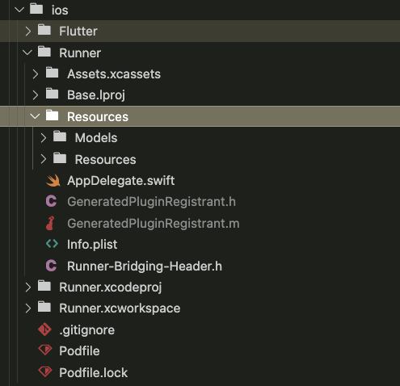
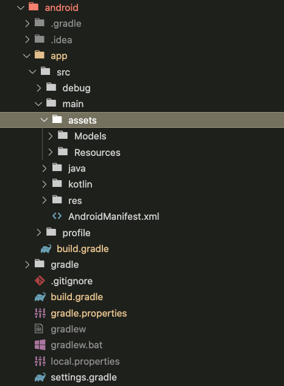
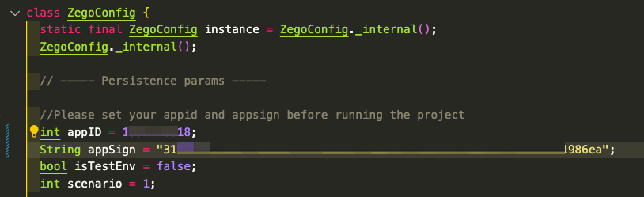
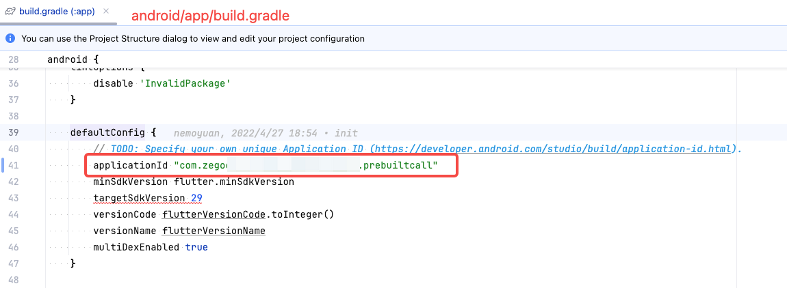
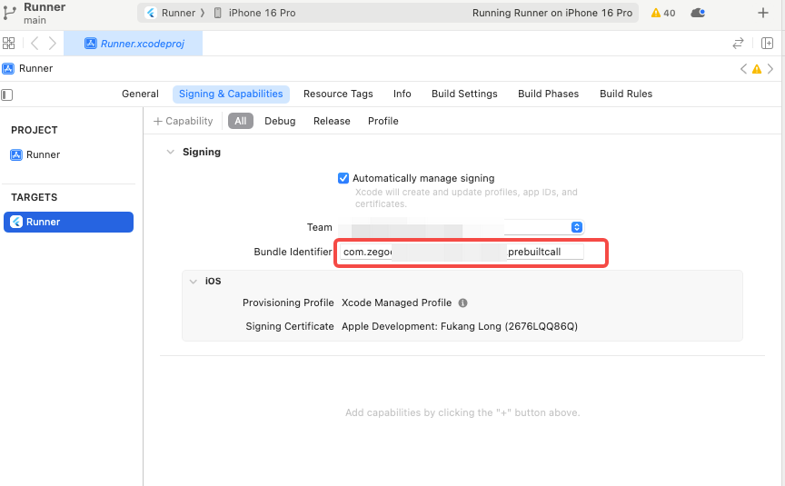

# zego_effects_flutter_demo

Zego Effects Flutter Demo User Guide

[中文说明](./README_CN.md)

### Quick Start

#### I. Download and Import Resources to Your Project

Download the latest version of the Effects SDK from the SDK download website (iOS download link: [here](https://doc-zh.zego.im/article/15898), Android download link: [here](https://doc-zh.zego.im/article/15899)). After extracting, import the `Resources` and `Models` folders into your project.

  --------------------------------------------------------------------------------------------------------------------------------
  Note: You only need to add the resources and models to your project. The Flutter SDK will automatically download the native Effects SDK dependencies, so you can ignore the SDK directory inside the downloaded Zip package.
  --------------------------------------------------------------------------------------------------------------------------------
  For **iOS**: Add the `Resources` and `Models` folders to your Xcode project and select the option to create folders in the group settings. Assuming your project is named `Runner` and you place all resources in the `Resources` folder (*you can specify any folder name*), your project directory structure should look like this after import:

  -------------------------------------------------------------------------------------------------------------------------------------------------------------------
  Note: You cannot directly place the `Resources` and `Models` folders into the Runner directory; instead, you must drag these two folders onto the Assets directory in the Xcode project and select the `Create folders` option when setting the Group.
  -------------------------------------------------------------------------------------------------------------------------------------------------------------------
  

  For **Android**: Add the `Resources` and `Models` folders to the `assets` directory of your Android project. Typically, resources should be placed in the `android/app/src/main/assets` directory, so your project directory structure should look like this after import:

  

#### II. Configure AppID and AppSign

Modify `lib/zego_config.dart`, and change the appID and appSign to the ones you applied for in the Zego control console.

  

  Also, change the `applicationID` for Android and `bundlerID` for iOS to the corresponding values filled in when you applied for Effects (technical support will assist with the application).

  

  

#### III. Run

Follow the running method of other Flutter projects and compile and run using Android Studio or Xcode.