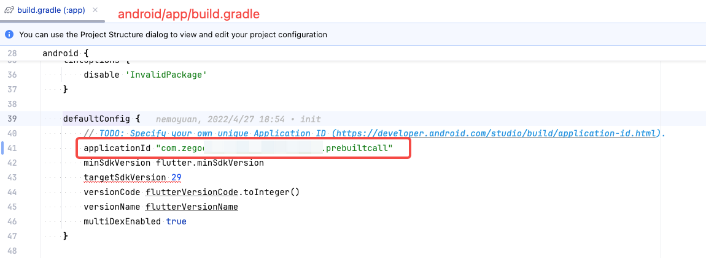
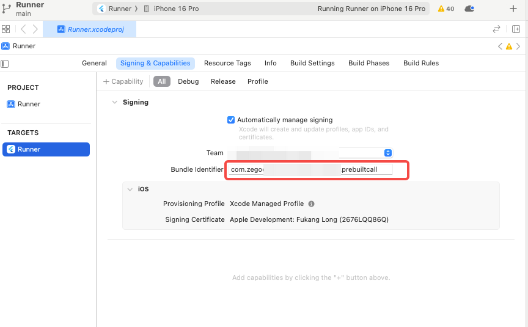

# zego_effects_flutter_demo

Zego Effects Flutter Demo 使用说明

## 快速开始

**一、下载并导入资源到项目**

从SDK下载网站下载最新版本的Effects
SDK（iOS下载链接：<https://doc-zh.zego.im/article/15898>，Android下载链接：<https://doc-zh.zego.im/article/15899>）。解压后，将
`Resources` 和 `Models` 文件夹导入到你的项目中。

  ---------------------------------------------------------------------------------------------------------------------------------------------
  注意：你只需要将资源和模型添加到你的项目中，Flutter SDK 会自动下载依赖的原生Effects SDK本身，也就是下载的Zip压缩包里的SDK目录你可以不用管。
  ---------------------------------------------------------------------------------------------------------------------------------------------

**iOS**：将 `Resources` 和 `Models`
文件夹添加到你的Xcode项目中，并在组设置中选择创建文件夹选项。假设你的项目名为
`Runner` ，并且你将所有资源放在 `Resources（`**这个文件夹名称可以任意指定**）
文件夹中，导入后你的项目目录结构应该如下所示：

  -------------------------------------------------------------------------------------------------------------------------------------------------------------------
  注意：你不能直接把 `Resources` 和 `Models` 文件夹放到Runner目录，而是必须把这两个文件夹拖动到Xcode工程里的Assets目录上，并且在Group设置时，选择 `Create folders` 选项。
  -------------------------------------------------------------------------------------------------------------------------------------------------------------------

**Android**：将 `Resources` 和 `Models` 文件夹添加到你的Android项目的 `assets`
目录中。通常，资源应该放置在 `android/app/src/main/assets`
目录中，所以导入后你的项目目录结构应该如下所示：

**二、配置AppID和AppSign**

修改`lib/zego_config.dart`，把其中的appID和appSign修改成在即构控制台申请的。

同时也要把android的`applicationID`和ios的`bundlerID`改成申请开通Effects时填的对应的值（技术支持会协助申请）。

**三、运行**

参照其他flutter项目的运行方式，使用Android Studio 或 Xcode
编译并运行即可。
